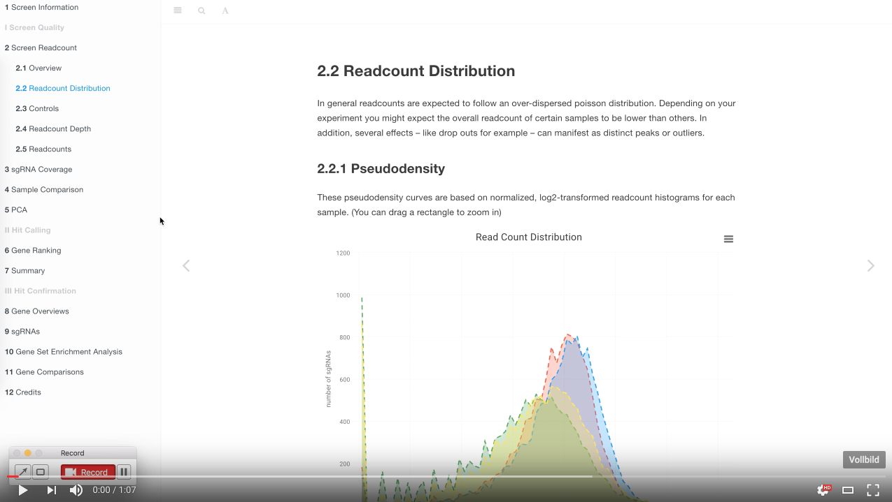
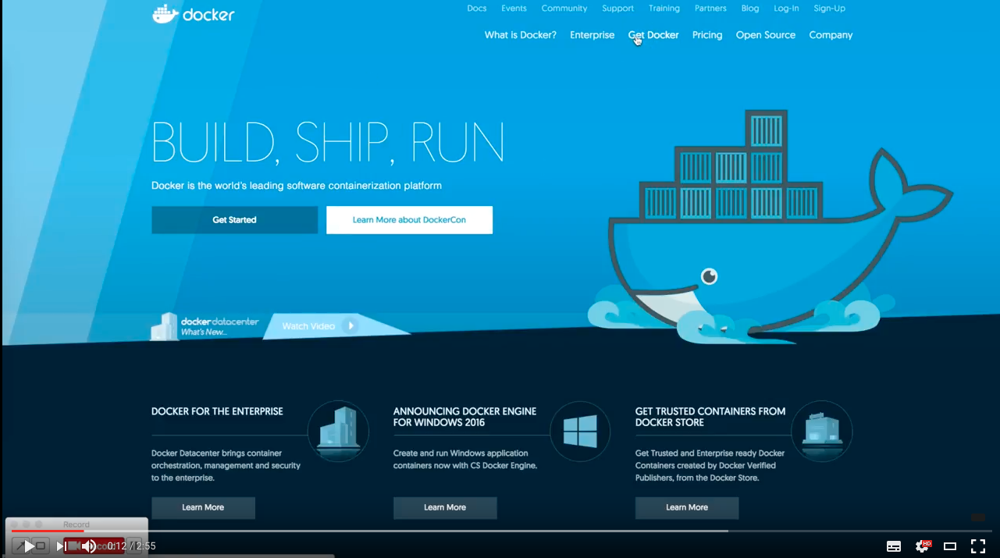
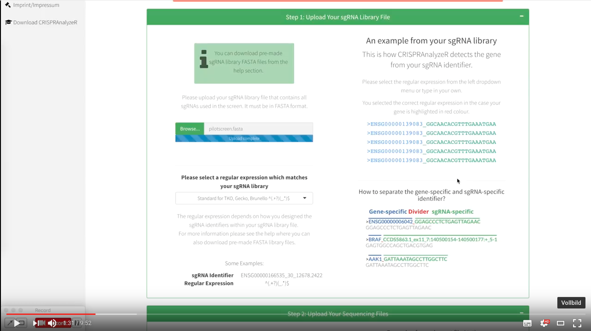
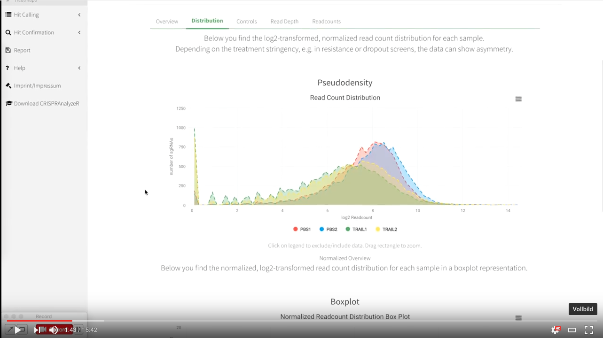

# CRISPRAnalyzeR - Fully-interactive Analysis and Documentation Suite for Pooled CRISPR Screens
Welcome to the CRISPRAnalyzeR Github page!

CRISPRAnalyeR is a web-based, fully interactive suite for the analysis and documentation of pooled CRISPR Screens.


**See [CRISPRAnalyzeR](http://crispr-analyzer.dkfz.de) in action! You can even go and analyse your own data right away!**

**Check out the [Wiki Page](https://github.com/boutroslab/crispr-analyzer/wiki) or scroll down for more information and help**

---

#<i class="fa fa-info" aria-hidden="true"></i> CRISPRAnalyzeR is now available for download - see below or check out the wiki.

---

**You can use the provided CRISPRAnalyzeR web-service or download the suite for installation within your lab/company.**

CRISPRAnalyzeR has been specifically developed to provide a fully-interactive, hollistic and exploratory analysis of pooled CRISPR Screens especially for those people that perform the screens themselves.
You can easily analyse your screen using 6 different hit calling and 1 essential gene calling methods as well as perform gene annotation enrichment, gene set analysis and get detailed information about your sgRNAs - all in a convenient web-browser interface.

**All you need is your sequencing data and the pooled CRISPR screen library file (we provide you with the most common ones) - and CRISPRAnalyzeR will help you to go from rawdata to potential followup candidates!**


## What makes CRISPRAnalyzeR the perfect suite to analyze pooled CRISPR Screens?

CRISPRAnalyzeR uses a **guided-analysis** approach. This means you will be **guided through the whole analysis, so that you can focus on the most important thing - your data**.

In brief, CRISPAnalyzeR consists of **four sections**, all paired with a great user-friendly UI:
- Screen Quality Estimation
- Hit Calling using multiple published hit calling methods
- Hit Confirmation with extensive Gene information, sgRNA information, Gene Set Analysis and much more
- Download of the interactive report that provides a comprehensive documentation of your screen


### The principle CRISPRAnalyzeR Guided-Analysis Workflow


**Analysing CRISPR Screens has never been easier - and has never been so much fun!**

# What CRISPRAnalyzeR offers you

CRISPRAnalyzeR is easy-to-use and assists you with the analysis of your screening data.
It contains **4 different steps**, each filled with nice visualizations, interactive tables and all the information you need.


## EIGHT Hit Calling Methods

CRISPRAnalyzeR combines the power of several CRISPR Analysis Workflows and **incorporates them into a streamlined, straight-forward and convenient workflow.**

**You run one analysis and get the information of 8 different analysis workflows**

We implemented SIX analysis workflows based on differentially expressed read counts:
- Wilcoxon Test
- DESeq2 (based on gene-level read counts)
- MAGeCK
- sgRSEA
- edgeR

Furthermore, we implmented TWO analysis workflows based on bayesion models that specifically identify gene essentiality/dropouts:
- BAGEL
- ScreenBEAM

## Hit Confirmation

__Use various external ressources to enrich information about your favourite candidate - all within the app and included in your report!__


## Interactive Report

[](https://www.youtube.com/embed/eusAj4LrSik)


# How to download the CRISPRAnalyzeR

#### Please check our [live demo](http://crispr-analyzer.dkfz.de), which you can also use to analyse your screening data.

You can get the CRISPRAnalyzeR suite as source code or as a ready-to-use Docker Container.

---

__Scroll down for the download options.__ 

__Please also check the minimum system requirements and licensing information.__

---

**The idea of installing CRISPRAnalyzeR is to provide a single installation within a Lab/Institute, so that everyone can access it via the web browser.  
However, you can also also install CRISPRAnalyzeR on your local machine only.**

### Minimum System Requirements
CRISPRAnalyzeR is based on R Shiny-Server and uses many different R packages and tools.
For a source code installation, we recommend the use of Ubuntu.

 | Source Code Installation | Docker Container Installation
----|---|----
Operating System|Ubuntu|Any supported OS by Docker
CPU|Dual Core (Quad Core recommended)| Dual Core (Quad Core recommended)
RAM|8 GB| 8GB
HDD|512 GB (SSD recommended)| 512 GB (SSD recommended)
Additional Software Packages | **See list below!** | All included in container


### Licenses
CRISPRAnalyzeR is published under the GPL-2 license and is **free for non-commercial use only**.
While CRISPRAnalyzeR does not require an additional license for commercial use itself, some included tools strictly require additional licensing.  
**Please note that Highcharts, the COSMIC database and the Enrichr API access require additional licensing for commercial use**.

__Highcharts Licensing Options__
https://shop.highsoft.com/

__COSMIC Licensing Options__
https://cancer.sanger.ac.uk/cosmic/license

__ENRICHR Licensing Options__
http://www.ip.mountsinai.org/


__It is your responsibility to obtain all required licenses in case of commercial usage!__


## Source Code

### Additional Required Software

Software | Version | Link 
---------|---------|------
Bowtie2 | 2.29 | http://bowtie-bio.sourceforge.net/bowtie2/index.shtml
CRISPR ReEvaluation Tool | Latest | https://github.com/boutroslab/Supplemental-Material
PERL | 5 | https://www.perl.org/
Python | 2.7.11 | https://www.python.org/ 
Python Scipy | latest | https://www.scipy.org/

# How to Install CRISPRAnalyzeR using the provided Docker Container


CRISPRAnalyzeR is available for a **platform-independent installation** as a so called Docker container.

CRISPRAnalyzeR re-evaluates every sgRNA during the analysis process. Thus, it needs to map each sgRNA against the reference genome.  
This can be performed locally (does not require a fast internet connection) or via e-crisp.org (requires fast internet >10 mbit).

By default, CRISPRAnalyzeR uses e-crisp.org to re-evaluate your sgrRNAs

You can install the CRISPRAnalyzeR by two ways:
1. Directly run the latest version from the online resource
2. Download and install CRISPRAnalyzeR on your machine before running it

__Please have a look at the installation tutorials below, which will assist you with the installation__

## Run and install directly from online resource (recommended)

1. Download the Docker Installer for your operating system from the [Docker Website](https://www.docker.com/products/overview)
2. Install the downloaded file
3. Start Docker on your machine (e.g. by double clicking on the Docker icon on windows or Mac). 
   A small docker symbol in the taskbar will tell you that docker is ready.
4. Open a terminal or command line (macOS: Terminal; Windows: cmd.exe)
4. Download and run the CRISPRAnalyzeR directly from the online repository (without additional settings)
   ```
   docker run --rm -p 3838:3838 boutroslab/crispranalyzer:latest
   ```
   It is important to keep the __3838:3838__ as this tells the software how to access it via the browser.
   
   If you want to run a specific version, just replace the `latest` with the specific version number
   
   ```
   docker run --rm -p 3838:3838 boutroslab/crispranalyzer:0.99
   ```

5. __Familiarize with the parameters you can use to start the CRISPRanalyzeR - they offer proxy settings or additional databases and local sgRNA re-evaluation.__

6. Access CRISPRAnalyzeR using your web-browser - __http://localhost:3838/CRISPRAnalyzeR__

## Run and install with local downloading of container file

1. Download the Docker Installer for your operating system from the [Docker Website](https://www.docker.com/products/overview)
2. Install the downloaded file
3. Start Docker on your machine (e.g. by double clicking on the Docker icon on windows or Mac). 
   A small docker symbol in the taskbar will tell you that docker is ready.
4. Open a Terminal (macOS and Linux) or Commandline (Windows) 
5. Download the CRISPRAnalyzeR docker files

  __Download the docker container__
  ```
  docker pull boutroslab/crispranalyzer:latest
  ```
   
6. Once Docker has finished with the installation, you can RUN the CRISPRAnalyzeR and provide several parameters to it.
   
   __To run CRISPRAnalyzeR with the default settings (see below)__, just type the following into your Terminal / Command Line  
   ```
   docker run --rm -p 3838:3838 boutroslab/crispranalyzer:latest
   ```
   **However, you can adjust multiple parameters when starting the CRISPRAnalyzeR!**
   
8. __Access the CRISPRAnalyzeR via your webbrowser: http://localhost:3838/CRISPRAnalyzeR__
   

---

## Available Paramaters to start CRISPRAnalyzeR

CRISPRAnalyzeR has been designed to be installed once on a machine and then accessed via a webbrowser. Therefore, you can adjust all parameters during the start of the CRISPRAnalyzeR.

Paramater | Meaning | Default Value | Accepted Values 
----------|---------|---------------|-----------------
websockets_behind_proxy | use Websocket protocol | TRUE | TRUE or FALSE
verbose_logfiles | output of log files | TRUE | TRUE or FALSE
database_path | Directory where database files are located | ./database | any path
COSMIC_database | Directory in which the COSMIC database is located | NULL | any path
disable_EnrichR | Whether to Disable the Enrichr API access | FALSE | TRUE or FALSE
EnrichR_URL | URL to the Enrichr API | http://amp.pharm.mssm.edu/Enrichr/ | Any URL
ecrispr_databasepath | Path to E-CRISP reference genomes | ./database | any path
bowtie_threads | Number of bowtie2 threads for mapping | 4 | any number
proxy_url | URL to your Proxy server | NULL | URL or NULL to inactivate
proxy_port | Proxy server Port | NULL |Port number of NULL to inactivate

### How to use the parameters

All parameter can be attach by the following:

```bash
docker run -rm -p -e PARAMETER1 -e PARAMETER2 -e PAREMETER3 3838:3838 boutroslab/crispranalyzer:latest
```

this means you always need to add `-e` in front of the parameters, e.g.:

```bash
-e websockets_behind_proxy=TRUE
-e verbose_logfiles=TRUE
-e bowtie_threads=4
```


## Installation Tutorial macOS

[](https://youtu.be/IFPojCjW0ns)


## Installation Tutorial Windows

## Installation Tutorial Ubuntu

## How to Start and Restart the CRISPRAnalyzeR


### How to setup CRISPRAnalyzeR for local re-evaluation of sgRNAs


You can download the human reference genome and tell CRISPRAnalyzeR to perform the re-evaulation locally on your computer. For this, you require at least 60GB of disk space and a fast computer.

__Step 1: Download the reference genome__  
Download the reference genome you need
* [Homo Sapiens](http://www.dkfz.de/signaling/crispr-downloads/DATABASES/homo_sapiens.tar.gz)
* [Mus Musculus](http://www.dkfz.de/signaling/crispr-downloads/DATABASES/mus_musculus.tar.gz)
* [Danio Rerio](http://www.dkfz.de/signaling/crispr-downloads/DATABASES/danio_rerio.tar.gz)

__Step 2: Extract the files to a folder (*DATABASEFOLDER*) of your desire__
Extract the downloaded file using gunzip (macOS/Linux) or Zip (Windows) to a *DATABASEFOLDER* of your desire.
Please note that you need to know the exact path to the *DATABASEFOLDER*!
e.g. /home/user1/databases

__Step 3: start CRISPRAnalyzeR and tell it where you files are__
Using the command line, start CRISPRAnalyzeR and provide the database path

```bash

```


---

# How to Install CRISPRAnalyzeR using the provided Source Code

---


---

## How to use the COSMIC Database and Enrichr API
### COSMIC (Catalogue Of Somatic Mutations In Cancer)

The COSMIC database can be found [here](https://cancer.sanger.ac.uk/cosmic).
By default, we do not provide the COSMIC database due to licensing compatibility.
In case you want to use the COSMIC database, please proceed as follows.

- Visit the [COSMIC Database Website](https://cancer.sanger.ac.uk/cosmic)
- If you aim for a commercial use, please see the [COSMIC Licensing Information Page](https://cancer.sanger.ac.uk/cosmic/license)
- Head to the [COSMIC download section](https://cancer.sanger.ac.uk/cosmic/download)
- Download the __COSMIC Mutation Data__ database file
- Extract the CosmicMutantExport.tsv.gz file to the __database__ folder within the CRISPR AnalyzeR
- Open the __config.R__ in the main folder of the CRISPRAnalyzeR Shiny directory and edit it 
```r
# COSMIC database file, needs to be located in database_path
# DEFAULT is NULL, as CRISPRAnalyzeR is not provided with COSMIC Database
config[["COSMIC_database"]] <- "CosmicMutantExport.tsv" # NULL if not available
```
- Restart the CRISPRAnalyzeR

*Please note that the COSMIC database is loaded during the analysis procedure and requires 1 GB of RAM.*

### Enrichr API
[Enrichr](http://amp.pharm.mssm.edu/Enrichr/) offers API access for a gene set analysis.
By default, CRISPRAnalyzeR has the Enrichr API access disabled.
You can activate the Enrichr API access during the installation by setting `EnrichR` to `TRUE`.
As an alternative you can edit the `config.R` in the main folder of CRISPRAnalyzeR:
```r
# EnrichR
# Enrichr is TRuE by default, but for commercial use a license HAS to be OBTAINED!
config[["EnrichR"]] <- TRUE # False if inactive
```

Please not that you require a license for commercial use.
A license can be obtained by contacting [the Mount Sinai Technology Development](http://www.ip.mountsinai.org/).

More information can be found at the [Enrichr Help Page](http://amp.pharm.mssm.edu/Enrichr/help#terms).


## How to perform an Analysis using CRISPRAnalyzeR
*YOUTUBE VID HERE*

---

## Download Sample Data

CRISPRAnalyzeR comes with read count sample data that can be accessed from the help on the data upload section.

Moreover, we offer additional sample data that you can download from our website:

- Drug Resistance Screen Data from CRISPR Library Designer
- Essential Genes Screen Data using the TKOv1 library

### Drug Resistance Screen Data (12000 sgRNAs)
This data was published before in
[F. Heigwer\*, T. Zhan\*, M. Breinig, J. Winter, D. Brügemann, S. Leible, M. Boutros, CRISPR library designer (CLD): software for multispecies design of single guide RNA libraries, Genome Biol., 2016, DOI:10.1186/s13059-016-0915-2](http://genomebiology.biomedcentral.com/articles/10.1186/s13059-016-0915-2 "Access manuscript directly")

#### Download Read Count Data
You can download pre-made read count files for data analysis from [here](http://crispr-analyzer.dkfz.de/fasta/CRISPRAnalyzeR_Readcount_sample-data.zip)

#### Download FASTQ Sequencing Data
You can download FASTQ Sequencing files from [here](http://crispr-analyzer.dkfz.de/fasta/CRISPRAnalyzeR_NGSFASTQ_sample-data.zip)

### Toronto Knockout Library Data (90000 sgRNAs)

This data was published in
[Steinhart,Z. et al. (2016) Genome-wide CRISPR screens reveal a Wnt-FZD5 signaling circuit as a druggable vulnerability of RNF43-mutant pancreatic tumors. Nat. Med.](http://www.nature.com/nm/journal/vaop/ncurrent/full/nm.4219.html)

#### Download Read Count Data
You can download raw read count data including a TKO sgNRA library FASTA file from [here](http://crispr-analyzer.dkfz.de/fasta/CRISPRAnalyzeR_TKO_FZD5_CRISPR_SampleData.zip)

---

## Pre-made sgRNA library FASTA files

CRISPRAnalyzeR offers pre-made sgRNA library files in FASTA format for use.
You can use them along with your read count (please see the format) or raw NGS sequencing files (.fastq.fz).

|Library Name |	Lab |	Pubmed ID |	Addgene |	Download |
|-------------|-----|-----------|---------|----------|
|CLD Benchmarking |	Boutros |	27013184 |	NA |	[FASTA](https://github.com/boutroslab/crispr-analyzer/tree/master/fasta/FASTA_CLD_library.fasta) |
|Gecko V2	| Zhang |	25075903 |	[here](https://www.addgene.org/crispr/libraries/geckov2/)	| [A+B FASTA](https://github.com/boutroslab/crispr-analyzer/tree/master/fastaFASTA_GeckoV2_all.fasta) |
|Torronto KnockOut Library (TKOv1) |	Moffat |	26627737 | [here](https://www.addgene.org/pooled-library/moffat-crispr-knockout/) |	[90K FASTA](https://github.com/boutroslab/crispr-analyzer/tree/master/fasta/FASTA_TKO_90K_library.fasta) & [85K FASTA](https://github.com/boutroslab/crispr-analyzer/tree/master/fasta/fasta/FASTA_TKO_85Ksupp_library.fasta) |
|Brunello	| Doench |	26780180	| [here](https://www.addgene.org/pooled-library/broadgpp-crispr-knockout/) |	[FASTA](https://github.com/boutroslab/crispr-analyzer/tree/master/fasta/FASTA_brunello_library.fasta) |
|CRISPRa / CRISPRi	| Weissmann	| 25307932 | [here](https://www.addgene.org/crispr/libraries/)	|	not available yet |
|Human Lentiviral sgRNA library high cleavage activity	| Sabatini |	26472758 | [here](https://www.addgene.org/crispr/libraries/)	|	[185K FASTA](https://github.com/boutroslab/crispr-analyzer/tree/master/fasta/FASTA_Wang_v2__185K_library.fasta) |
|Human Lentiviral sgRNA sub libraries |	Sabatini |	24336569	| [here](https://www.addgene.org/crispr/libraries/) |	not available yet |


## FASTQ Common Extraction Settings for published CRISPR libraries
If you use FASTQ sequencing files directly, CRISPRAnalyzeR requires the use of a so-called 'regular expression' to extract the sgRNA target sequence from your sequencing data.

**However, the CRISPRAnalzyeR comes with some pre-defined settings for commonly used screening libraries and their vector systems.**
In case you don't know which is the best setting for your screen, please do not hesitate and create an issue or write me an email.


| Plasmid Name |	Lab	 |Addgene ID |	Regular Expression |
|--------------|------|-----------|--------------------|
| Lenticrisp V2 |	Feng Zhang |	[52961](https://www.addgene.org/52961)	| **Default** `ACC(.{20,21})G` |
| Lentiguide (Puro)	| Feng Zhang |	[52963](https://www.addgene.org/52963) |	**Default** `ACC(.{20,21})G` |
| Human Lentivirus Library V1 |	Haoquan Wu |	[69763](https://www.addgene.org/69763) |	`GTTT(.{20})G` |
| pLCKO (Moffat TKO) |	Moffat |	[73311](https://www.addgene.org/73311)	| `ACCG(.{20,21})G` |
| pU6-sgRNA EF1Alpha-puro-T2A-BFP (CRISPRa/i) |	Weissman |	[60955](https://www.addgene.org/60955), [62217](https://www.addgene.org/62217), [60956](https://www.addgene.org/60956)	| `GTTG(.{20})G` |


# How must the Data be Formatted?

CRISPRAnalyzeR requires you to upload a sgRNA library FASTA file which contains all sgRNAs of your screen.
Moreover, you can either use your sequencing data directly as gzipped FASTQ files (.fastq.gz) or already calculated, non-normalized, read count files (.txt).

## Format of sgRNA library FASTA File
A sgRNA library file must be in FASTA format and include the unique sgRNA identifier as well as the target sequence in 5'->3' direction.
Please make sure **that only the exact target sequence is used here**.

```
>ENSG00000006042_0_4299.561
GGAGCCCTCTGAGTTAGAAC 
>ENSG00000006042_5_4299.588
GAAGATGCCTCGTAAGGCCA 
>ENSG00000006042_6_4299.588
GAGATGCCTCGTAAGGCCAT 
```

Moreover, **the gene identifier needs to be a part of the unique sgRNA identifier** as shown here


so that CRISPRAnalyzeR knows which sgRNA belongs to which gene.

**Please note that all sgRNA identifiers need to be unique.**


## Format of Raw Sequencing Data (.fastq.gz)

Next Generation Sequencing files usually are provided in FASTQ format:

```
@M01100:47:000000000-AH40C:1:1101:12289:2057 1:N:0:4
AACACCGTCAGTGTGCTTGCCCCACTGTTTTAGAGCTAGAAATAGCAAGTT
+
GGGGGGGGGGDGGGGGGGGGGGGGGGGGGGGGGGGGGGGGGGGGGGGGGGG
@M01100:47:000000000-AH40C:1:1101:8758:2058 1:N:0:4
AAACACCGGTTTTGAAACTGCGGACACGTTTAGAGCTAGAAATAGCAAGTTA
+
GGGGGGGEGGGGGGGGGDGGFGGGEEGGFFGGFFCFFF=AFF<CEFFF@EFE
```

For easier use and faster data handling, CRISPRAnalyzeR required **gzipped FASTQ files (.fastq.gz)**.  
**FASTQ files are usually provided in a gzipped format by the sequencing facility.**

## Format of Read Count Files (.txt)

CRISPRAnalyzeR requires a separate read count file for each sample, which needs to be tab-separated.

```
sgRNA                                Count
ENSG00000053900_GAAAGCAATGAGATCCCGCT	28
ENSG00000053900_GAAGCAATGAGATCCCGCTT	62
ENSG00000053900_GAAGCGGGATCTCATTGCTT	92
```
The first column describes which sgRNA identifier (must be the same as in the sgRNA library FASTA file) was used, the second column describes how many reads were present for this unique sgRNA.

**Please note that all sgRNA identifiers need to be unique.**


# Contact

**Jan Winter - jan.winter@dkfz-heidelberg.de**

@winterj86

*Manuscript submitted*


---

# Tutorials

## Upload Read Count Data and Setup Screen
[](https://www.youtube.com/watch?v=J2WJFAo2OTY)

## Assessing Screen Quality
[](https://www.youtube.com/watch?v=zIC8OZBX_5U)
